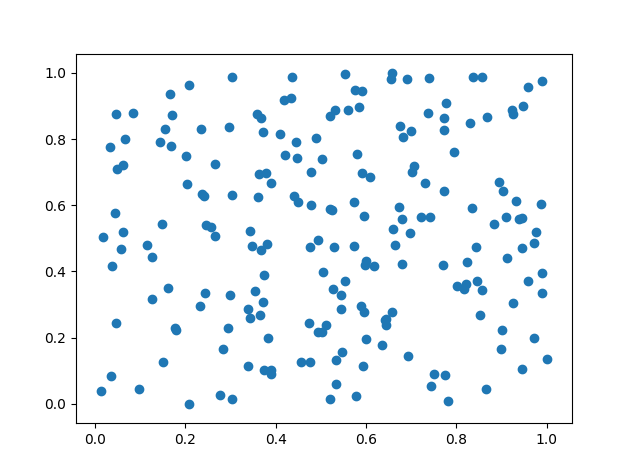
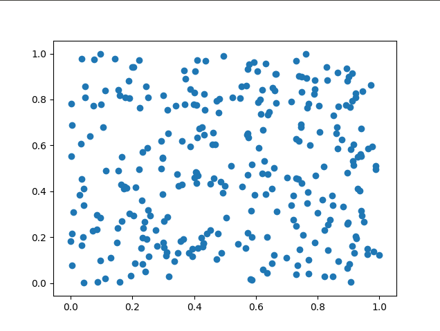
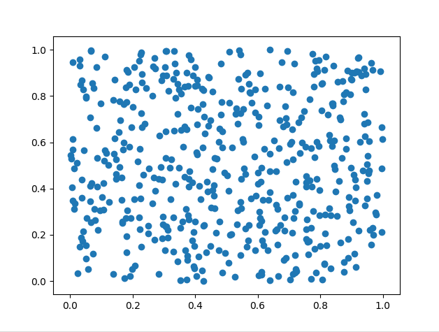
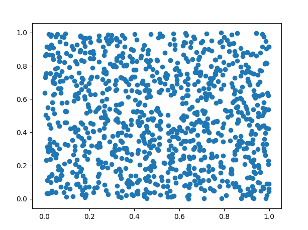
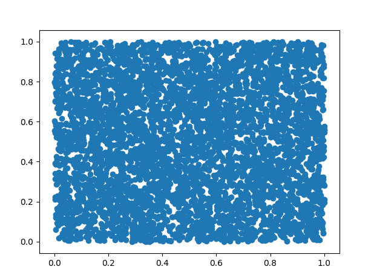

# Sister Random Point Generator

Takes in a hardcoded input to plot an n amount of points on a grid.

edit: Now takes in an input. If you have python3 installed just run
`python3 cates-thingy.py`

Then enter the number of points you want to plot

## Example Grids

### 100

### 200

### 300

### 500

### 1000

### 5000

